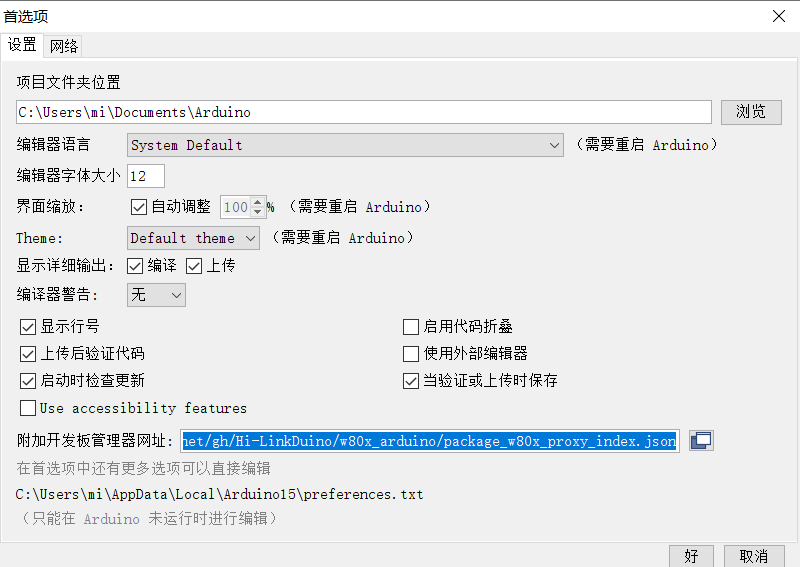
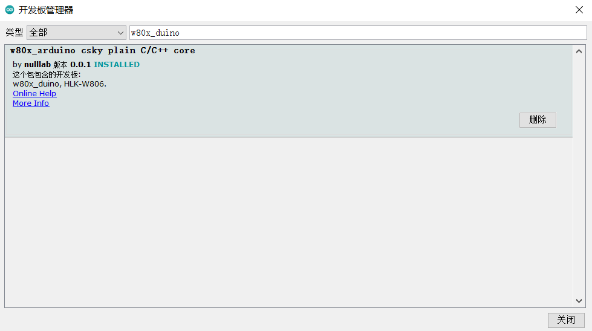
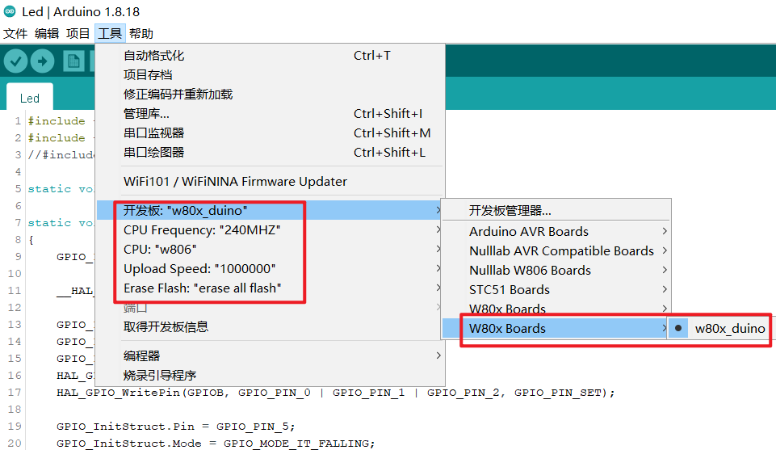

# w80x_duino
w806为[联盛德](http://www.winnermicro.com/)公司推出一款基于平头哥（XT-E804）架构的MCU

**W806芯片参数**

- 封装QFN56, 6mm x 6mm, pin间距0.35mm

**MCU 特性**

- 集成 32 位 XT804 处理器，工作频率 240MHz，内置 DSP、浮点运算单元与安全引擎
- 内置 1MB Flash，288KB RAM
- 集成 PSRAM 接口，支持最高 64MB 外置 PSRAM 存储器
- 集成 6 路 UART 高速接口
- 集成 4 路 16 比特 ADC，最高采样率 1KHz
- 集成 1 个高速 SPI 接口（从接口），支持最高 50MHz
- 集成一个主/从 SPI 接口
- 集成 1 个 SDIO_HOST 接口，支持 SDIO2.0、SDHC、MMC4.2
- 集成 1 个 SDIO_DEVICE，支持 SDIO2.0，最高吞吐率 200Mbps
- 集成 1 个 I2C 控制器
- 集成 GPIO 控制器，最多支持 44 个 GPIO
- 集成 5 路 PWM 接口
- 集成 1 路 Duplex I2S 控制器
- 集成 LCD 控制器，支持 4x32 接口
- 集成 1 个 7816 接口
- 集成 15 个 Touch Sensor

**供电**

- 3.3V 单电源供电
- 支持工作、睡眠、待机、关机工作模式
- 待机功耗小于 10uA

## w80x_duino开发板Arduino IDE支持包安装

1、**文件->首选项**

2、在附加开发板管理器网址输入如下网址：

> https://cdn.jsdelivr.net/gh/Hi-LinkDuino/w80x_arduino/package_w80x_proxy_index.json

3、**工具->开发板->开发板管理**
搜索**w80x_duino**,选择最新版本安装（如果搜索不到，请安装arduino IDE1.8.15以上）

4、**工具->开发板**

代表w80x_duino开发环境搭建完成

5、**上传**
上传的过程忠按提示按主板上的复位键即可下载

## w80x_duino开发计划
打勾的代表已经实现并验证，没有打勾的代表正在开发中，期待更多开发者一起维护

- [x] [支持arduino ide开发基于w806的官方SDK API调用开发]()
- [ ] [GPIO适配]()
- [ ] [Serial适配]()
- [ ] [ADC适配]()
- [ ] [PWM适配]()
- [ ] [timer适配]()
- [ ] [I2C适配]()
- [ ] [SPI适配]()
- [ ] [flash模拟eerom操作适配]()

### 说明
由于此芯片为平头哥新架构，工具链和各种工具几乎是全新的，所有arduino标准接口都得全部适配。工作量还是挺大。
大家使用有问题，直接提[issue](https://github.com/Hi-LinkDuino/w80x_arduino/issues)
欢迎开发者协同开发提交commit，本项目会持续更新。

## 致谢
- Hi-LINK海联科开发生产了此开发板
- 此开源项目由[nulllab空想实验室](https://github.com/nulllaborg/)团队维护，并得到联盛德官方捐赠
